# IMART - MERN E-commerce Platform

**IMART** is a full-stack Everyday Use Retail Store web application built using the MERN stack (MongoDB, Express.js, React.js, Node.js).  
This project was created by **Ishu Anand Malviya** as a demonstration of modern web development practices, scalable architecture, and user-centric design.

---

## Table of Contents

- [Features](#features)
- [Tech Stack](#tech-stack)
- [Project Structure](#project-structure)
- [Installation & Setup](#installation--setup)
- [Environment Variables](#environment-variables)
- [Usage](#usage)
- [Customization](#customization)
- [Author](#author)
- [License](#license)

---

## Features

- **User Authentication:** Register, login, logout, JWT-based session management.
- **Seller Portal:** Seller registration, authentication, and dashboard for managing products.
- **Product Catalog:** Browse products by category, search, filter, and view detailed product pages with ratings and reviews.
- **Cart & Orders:** Add/remove items from cart, place orders, view order history.
- **Profile Management:** Update user/seller profile, upload profile pictures.
- **Demo Payment Flow:** Simulated payment process for orders (no real payment gateway).
- **Newsletter Subscription:** Users can subscribe for updates.
- **Team & Testimonials:** About page with team info and customer testimonials.
- **Contact Form:** Users can send messages to site administrators.
- **Responsive Design:** Mobile-friendly UI using Tailwind CSS.
- **RESTful API:** Well-structured backend API for all resources.

---

## Tech Stack

- **Frontend:** React.js, Tailwind CSS, Vite
- **Backend:** Node.js, Express.js
- **Database:** MongoDB (with Mongoose ODM)
- **File Uploads:** Multer, Cloudinary
- **Authentication:** JWT, custom middlewares
- **Other:** Axios, React Context API, dotenv

---

## Project Structure

```
Imart-main/
│
├── backend/
│   ├── configs/         # DB, Cloudinary, Multer configurations
│   ├── controllers/     # Route handlers (user, product, order, etc.)
│   ├── middlewares/     # Auth, error handling, etc.
│   ├── models/          # Mongoose schemas
│   ├── routes/          # Express routers
│   ├── server.js        # Backend entry point
│   └── .env.example     # Sample environment variables
│
├── frontend/
│   ├── public/          # Static assets
│   ├── src/
│   │   ├── assets/      # Images, dummy data
│   │   ├── components/  # Reusable React components
│   │   ├── context/     # Global state/context
│   │   ├── pages/       # Route pages (Home, Products, Seller, etc.)
│   │   ├── App.jsx      # Main app component
│   │   └── main.jsx     # Frontend entry point
│   ├── index.html       # HTML template
│   ├── index.css        # Global styles
│   ├── tailwind.config.js
│   ├── vite.config.js
│   └── .env.example     # Sample environment variables
│
└── README.md            # Project documentation
```

---

## Installation & Setup

### 1. Clone the Repository

```bash
git clone https://github.com/ishu-anand-malviya/imart-main.git
cd imart-main
```

### 2. Install Dependencies

- **Backend:**
  ```bash
  cd backend
  npm install
  ```
- **Frontend:**
  ```bash
  cd ../frontend
  npm install
  ```

### 3. Configure Environment Variables

- Copy `.env.example` to `.env` in both `backend` and `frontend` folders.
- Fill in required values (MongoDB URI, JWT secret, Cloudinary credentials, etc.).

### 4. Start the Application

- **Backend:**
  ```bash
  cd backend
  npm start
  ```
- **Frontend:**
  ```bash
  cd frontend
  npm run dev
  ```

- **Access the app:**
  - Frontend: [http://localhost:5173](http://localhost:5173)
  - Backend API: [http://localhost:4000](http://localhost:4000)

---

## Environment Variables

**Backend `.env` example:**
```
MONGO_URI=your_mongodb_connection_string
JWT_SECRET=your_jwt_secret
CLOUDINARY_CLOUD_NAME=your_cloudinary_cloud_name
CLOUDINARY_API_KEY=your_cloudinary_api_key
CLOUDINARY_API_SECRET=your_cloudinary_api_secret
```

**Frontend `.env` example:**
```
VITE_API_URL=http://localhost:4000
```

---

## Usage

- Register as a user or seller.
- Browse products, add to cart, and place orders.
- Sellers can add/edit products from their dashboard.
- Update profile and upload profile picture.
- Subscribe to newsletter and contact the team.

---

## Customization

- Add new product categories, features, or payment gateways.
- Update UI components and styles in the frontend.
- Extend backend logic for shipping, analytics, etc.

---
## PROJECT PREVIEW

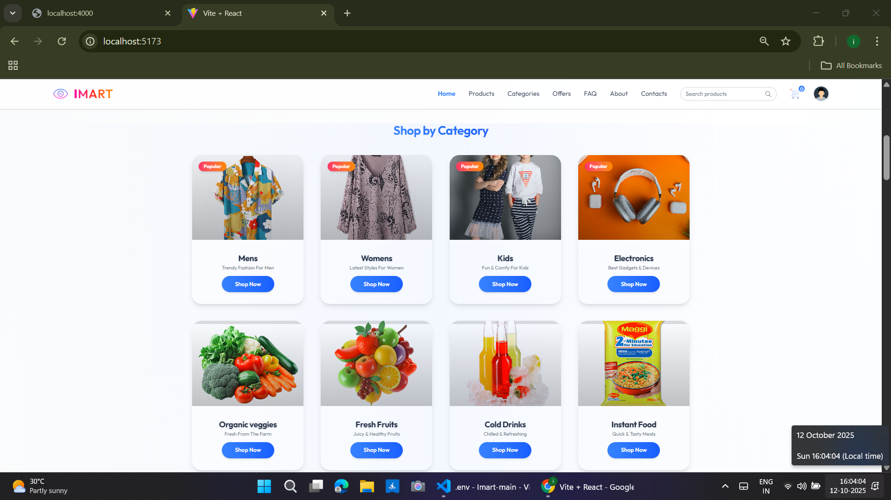
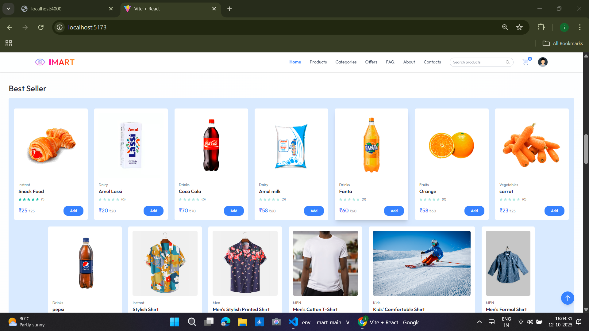
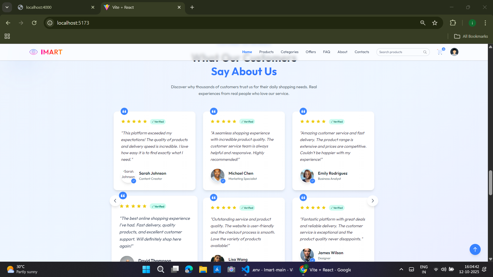
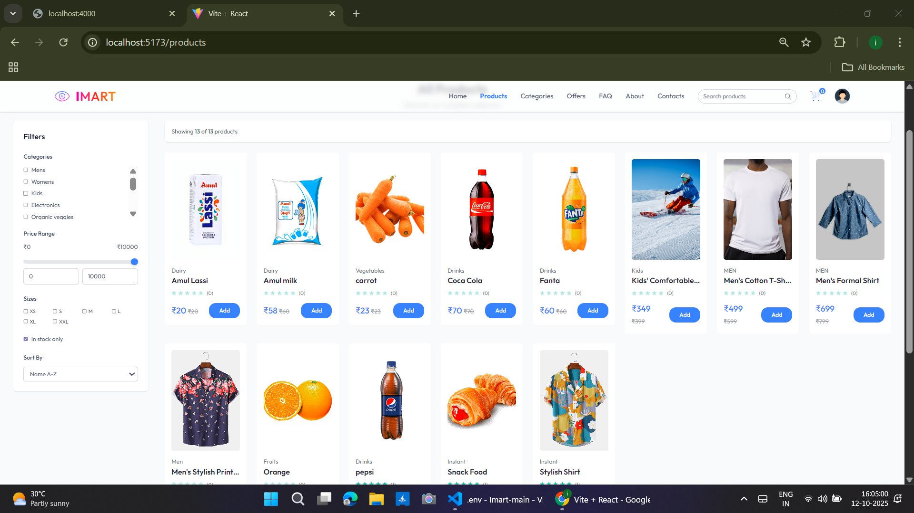
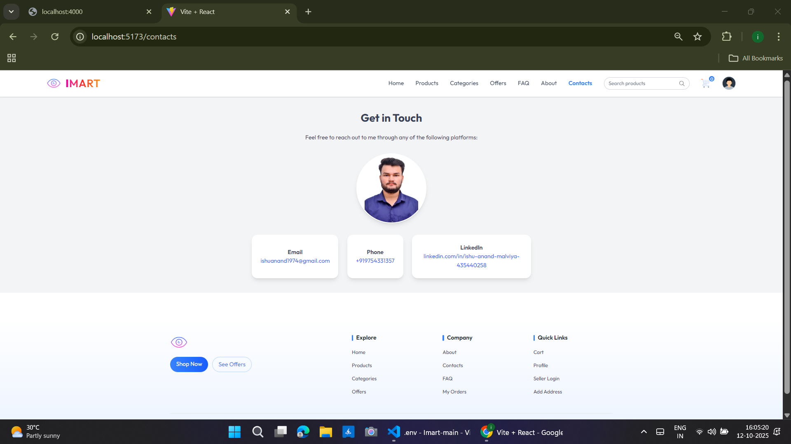
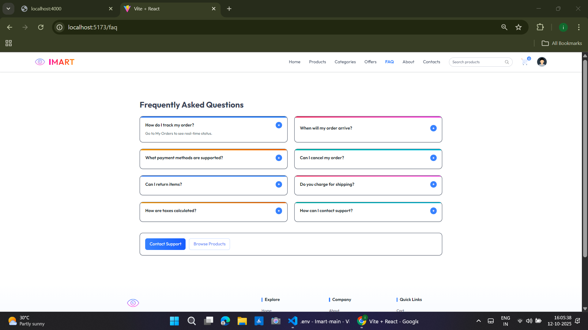
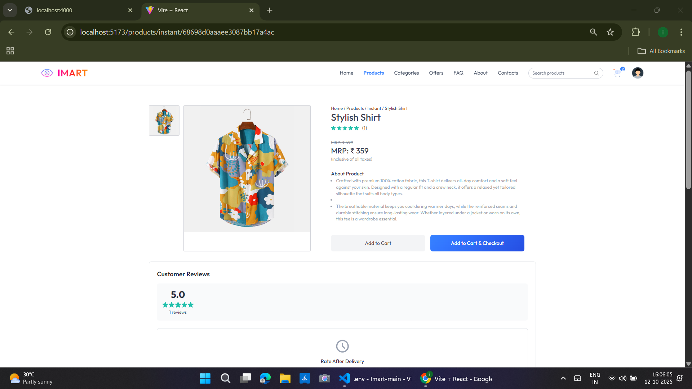
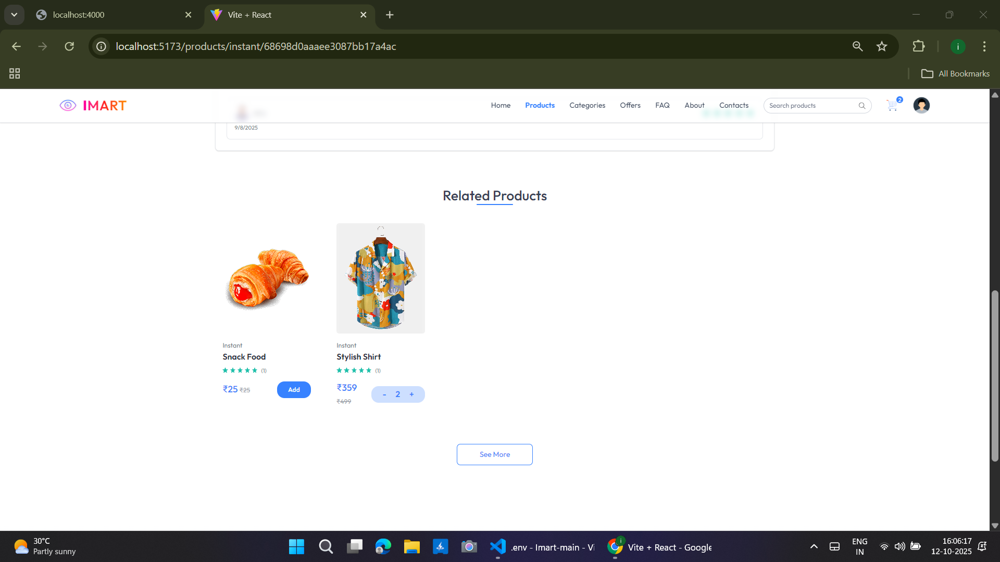
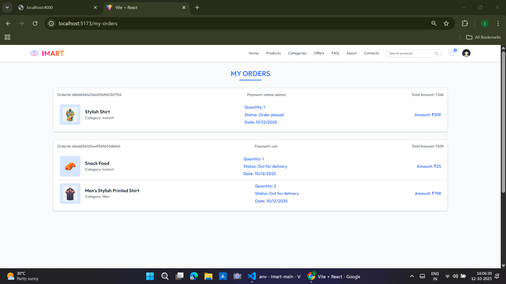
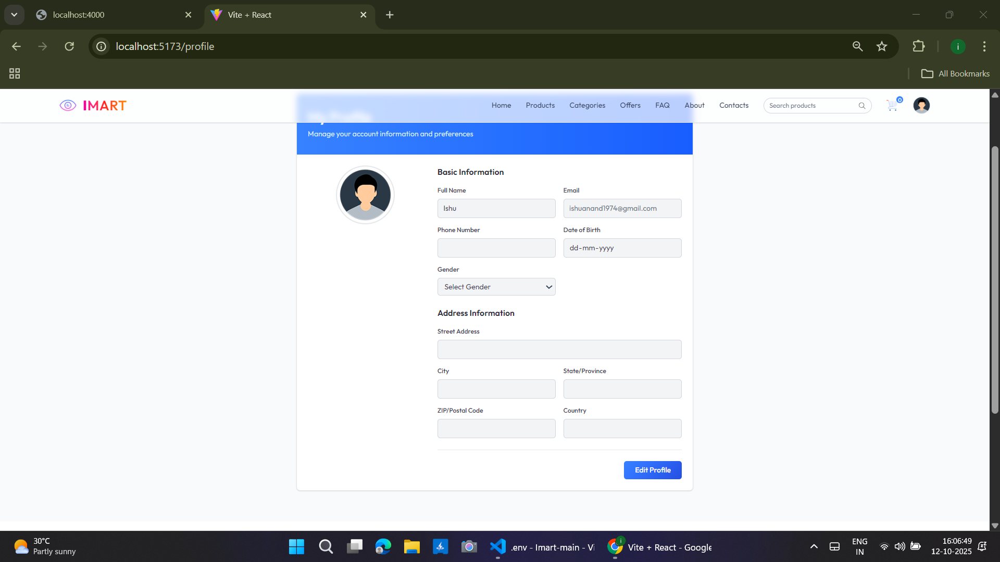
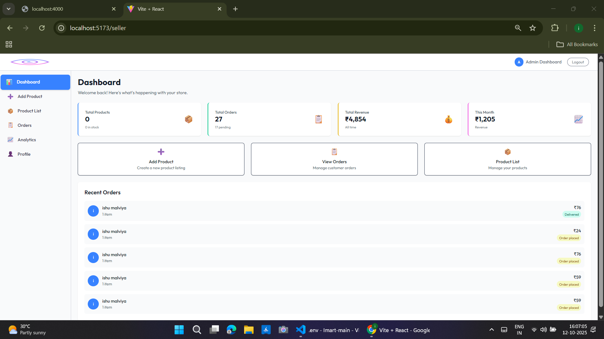
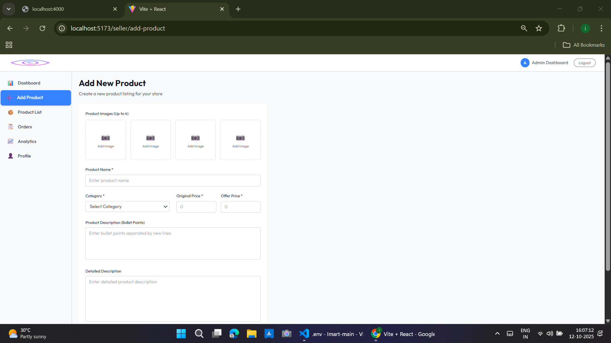
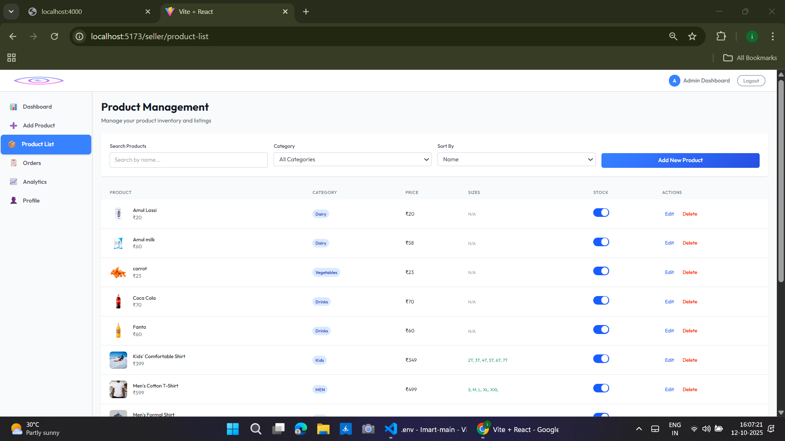
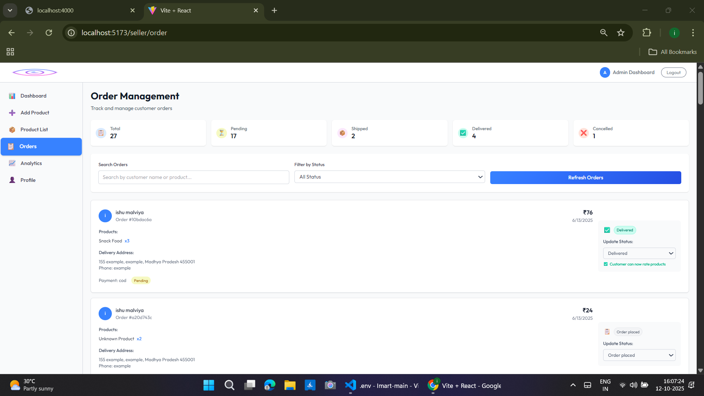
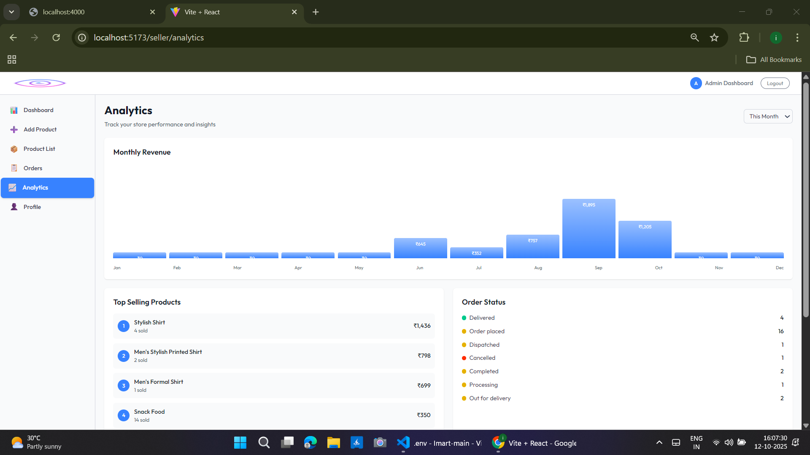
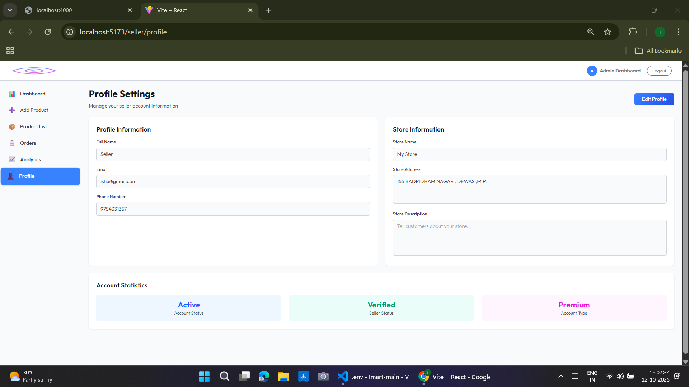


## Author

**Ishu Anand Malviya**  
[LinkedIn](https://www.linkedin.com/in/ishu-anand-malviya)  
[GitHub](https://github.com/ishu-anand-malviya)

---

## License

This project is for demonstration and educational purposes only.

---
